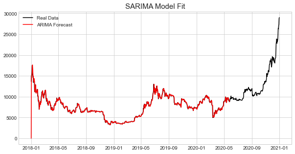
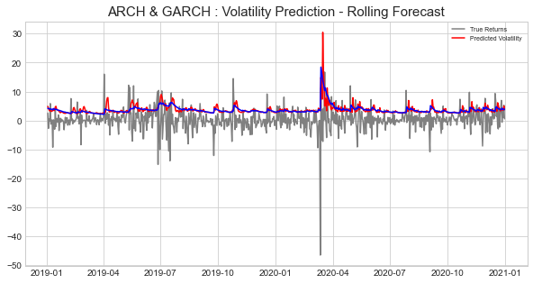

# 일별 비트코인 데이터를 이용한 시계열 예측
- 2018년부터 2020년까지의 일별 비트코인 가격 데이터를 통해 미래 시점의 가격을 예측하고자 함
- 통계적 시계열 모형인 ARIMA에 Seasonality를 고려한 SARIMA를 사용하여 Regression 수행
- 잔차에 대한 ACF/PACF를 확인하여 자기 상관을 조사
- 훈련 데이터를 적합한 모델에 테스트 데이터를 대입하여 예측 및 RMSE 비교
- 변동성에 대한 예측을 수행하는 ARCH와 GARCH를 사용하여 Volatility Clustering 현상 확인
<p align="center"></p>
<p align="center"></p>
<br/>

## 시작하기

### 선행 설치 조건

python 3.6 이상

```
pandas
numpy
sklearn
statsmodels
matplotlib
seaborn
pandas_datareader
pmdarima
arch
```

## 파일 설명
#### 1) data_utils.py

    데이터를 불러와 시계열 데이터로 변경하고 훈련, 테스트 데이터로 분할하는 함수

#### 2) plot_utils.py

    데이터 & 특성, ACF & PACF, 모델 적합 등 plotting 관련 함수

#### 3) test_utils.py

    Stationary 테스트(ADF, KPSS) 함수
    
#### 4) forecast.py

    테스트 데이터에 대한 예측 및 plotting 함수
    
#### 5) main.ipynb

    모델 생성 및 테스트
    
## Contributiong / 기여

* 양동욱(dongwook412@naver.com)
* 황보성훈(thehb01@gmail.com)
